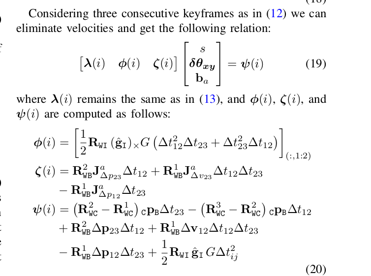

## Init Compared

### Vins mono init
#### part of V.

loosely-coupled sensor funsion method to get initial values.

include vison-only SLAM, or Structure from Motion, has a good property of initialzation.

A. Sliding window Vision-Only SFM

1. stable feature tracking(>30 tracked features)

2. sufficient parallax(more than 20 rotation-compensated pixels.) between latest frame and any other frames in the sliding windows.

$$q^{c_0}_{b_k} = q^{c_0}_{c_k}\bigotimes (q^b_c)^{-1}$$
$$s\tilde{p}^{c_0}_{b_k} = s\tilde{p}^{c_0}_{c_k}-R^{c_0}_{b_k}p^b_c$$

B. Visual-Inertial Alignment
1. GyroBias Calibration. Consider 

from SFM $q^{c_0}_{b_{k+1}}$ and $q^{c_0}_{b_k}$
from imu pre-integration $\hat{\gamma}^{b_k}_{b_{k+1}}$

so we can have：(second equation is from: linearize the IMU preintegration term with respect to gyroscope bias.)

$$\min_{\delta bw}\sum_{k\in B}||q^{c_0}_{b_{k+1}}\bigotimes q^{c_0}_{b_k}\bigotimes \gamma^{b_k}_{b_{k+1}}||^2$$

$$\gamma^{b_k}_{b_{k+1}} \approx \hat{\gamma}^{b_k}_{b_{k+1}}\bigotimes\left[\begin{matrix}
    1 \\ \frac{1}{2}J^\gamma_{b_w}\delta b_w
\end{matrix} \right] $$

2. Velocity, Gravity Vector and Metric Scale Initialization:

after gyrobias is initialized, now we has the essential state like this:

$$X_I = \left[v^{b_0}_{b_0},  v^{b_1}_{b_1}, \cdots, v^{b_n}_{b_n}, g^{c_0}, s\right]$$

we had the two equations:

$$\alpha ^{b_k}_{b_{k+1}} = R^{b_k}_{c_0}(s(\tilde{p}^{c_0}_{b_{k+1}}-\tilde{p}^{c_0}_{b_k})+\frac{1}{2}g^{c_0}\Delta t^2_k-R^{c_0}_{b_k}v^{b_k}_{b_k}\Delta t_k)$$

$$\beta^{b_k}_{b_{k+1}}=R^{b_k}_{c_0}(R^{c_0}_{b_{k+1}}v^{b_{k+1}}_{b_{k+1}}+g^{c_0}\Delta t_k-R^{c_0}_{b_k}v^{b_k}_{b_k})$$

combine here and the top-equation we can get following linear measurement model:

$$\left[\begin{matrix}
    \alpha^{b_k}_{b_{k+1}}\\\beta^{b_k}_{b_{k+1}}
\end{matrix}\right] = \left[\begin{matrix}
    -R^{b_k}_{c_0}R^{c_0}_{b_k}\Delta tv^{b_k}_{b_k}+\frac{1}{2}R^{b_k}_{c_0}\Delta t^2g^{c_0}+R^{b_k}_{c_0}(\tilde{p}^{c_0}_{b_{k+1}}-\tilde{p}^{c_0}_{b_k})s \\
    R^{b_k}_{c_0}R^{c_0}_{b_{k+1}}v^{b_{k+1}}_{b_{k+1}}+R^{b_k}_{c_0}\Delta t_k g^{c_0}-R^{b_k}_{c_0}R^{c_0}_{b_k}v^{b_k}_{b_k}
\end{matrix}\right] \\ = \left[\begin{matrix}
    -\Delta tv^{b_k}_{b_k}+\frac{1}{2}R^{b_k}_{c_0} \Delta t^2g^{c_0}+R^{b_k}_{c_0}(\tilde{p}^{c_0}_{b_{k+1}}-\tilde{p}^{c_0}_{b_k})s \\
    R^{b_k}_{b_{k+1}}v^{b_{k+1}}_{b_{k+1}}+R^{b_k}_{c_0}\Delta t_k g^{c_0}-v^{b_k}_{b_k}
\end{matrix}\right] \\ = \left[\begin{matrix}
    H^{b_k}_{b_{k+1}}X_I+n^{b_k}_{b_{k+1}}
\end{matrix} \right]$$

将$p^{c0}_{b_{k+1}}$变成$p^{c_0}_{c_{k+1}}$
$$s\tilde{p}^{c_0}_{b_k} = s\tilde{p}^{c_0}_{c_{k}}+R^{c_0}_{b_k}p^b_c$$

so the $R^{b_k}_{c_0}(\tilde{p}^{c_0}_{b_{k+1}}-\tilde{p}^{c_0}_{b_k})$ can change to: 

$$R^{b_k}_{c_0}(\tilde{p}^{c_0}_{b_{k+1}}-\tilde{p}^{c_0}_{b_k}) = R^{b_k}_{c_0}(\tilde{p}^{c_0}_{c_{k+1}}-\tilde{p}^{c_0}_{c_k}-\frac{1}{s}(R^{c_0}_{b_{k+1}}p^b_c-R^{c_0}_{b_k}p^b_c))\\
=R^{b_k}_{c_0}(\tilde{p}^{c_0}_{c_{k+1}}-\tilde{p}^{c_0}_{c_k})-\frac{1}{s}(R^{b_k}_{c_0}R^{c_0}_{b_{k+1}}p^b_c - p^b_c)$$

so the value should be delete  from the $\alpha^{b_k}_{b_{k+1}}$中的这几项，方便计算。

其中 $H^{b_k}_{b_{k+1}}$ 可以用如下公式表示：

$$H^{b_k}_{b_{k+1}} = \left[\begin{matrix}
    -I\Delta t & 0 & \frac{1}{2}R^{b_k}_{c_0}\Delta t^2_k & R^{b_k}_{c_0}(\tilde{p}^{c_0}_{c_{k+1}}-\tilde{p}^{c_0}_{c_k}) \\ -I & R^{b_k}_{c_0}R^{c_0}_{b_{k+1}} & R^{b_k}_{c_0}\Delta t_k & 0
\end{matrix}\right]$$

$$\hat{z}^{b_k}_{b_{k+1}} = \left[\begin{matrix}
    \hat{\alpha}^{b_k}_{b_{k+1}} - p^b_c+R^{b_k}_{c_0}R^{c_0}_{b_{k+1}}p^b_c\\ \hat{\beta}^{b_k}_{b_{k+1}}
\end{matrix} \right]$$

so the final optimization equation is :

$$\min_{X_I}\sum_{k \in B}||\hat{z}^{b_k}_{b_{k+1}}-H^{b_k}_{b_{k+1}}X_I||^2$$

3. Gravity Refinement
the magnitude of gravity vector is known. the result is only 2Dof remaining for gravity vector. 

reparameterize the gravity with two variables on its tangent space.

than the part is TIGHTLY-COUPLED Monocular VIO

### ORB VIO init

also use the preintegration.

IMU initialization

A. GyroBias Estimation

$$arg\min_{b_g}\sum^{N-1}_{i=1}\left|\left|\log((\Delta R_{i,i+1}Exp(J^g_{\Delta R}b_g))^TR^{i+1}_{BW}R^i_{WB} \right|\right|$$

B. Scale and Gravity Approximation
intrducing $s$ between Camera and IMU coordinate system;
$${}_wp_b = s{}_wp_c+R_{wc}{}_cp_b$$

we should neglecting the point accelerometer bias, follows like that:

$$s{}_wp_c^{i+1} = s{}_wp^i_c+{}_wv^i_b\Delta t_{i,i+1}+\frac{1}{2}g_w\Delta t^2_{i,i+1}+R^i_{wb}\Delta p_{i,i+1}+(R^i_{wc}-R^{i+1}_{wc}){}_cp_b$$

we can change the function from current equation to $\left[\begin{matrix}
    \lambda(i)& \beta(i)\end{matrix}\right]\left[\begin{matrix} s \\ g_w\end{matrix}\right] = \gamma(i)$

we can easily get these matrix.

C. Acc Bias Estimate and Scale and Gravity Direction Refinement.

estimate the $R_{wi}$

$$R_{wi} = Exp(\hat{v}\theta) \\ \hat{v} = \frac{\hat{g}_I\times\hat{g}_W}{||\hat{g}_I\times \hat{g}_W||}, \theta = atan2(||\hat{g}_I \times \hat{g}_W||, \hat{g}_I\hat{g}_W)$$

so the current Gravity vector is $g_w = R_{wi}\hat{g}_IG$

the rotation can be opti using a perturbation $\delta\theta$

$$g_w = R_{wi}Exp(\delta\theta)\hat{g}_IG$$

with a first-order approximation（一阶近似$f(x+\Delta x) = f(x)+f'(x)\Delta x$）:
$$g_w \approx R_{wi}\hat{g}_I G - R_{wi}(\hat{g}_I)^{\times}G\delta\theta$$

change status can like this:

