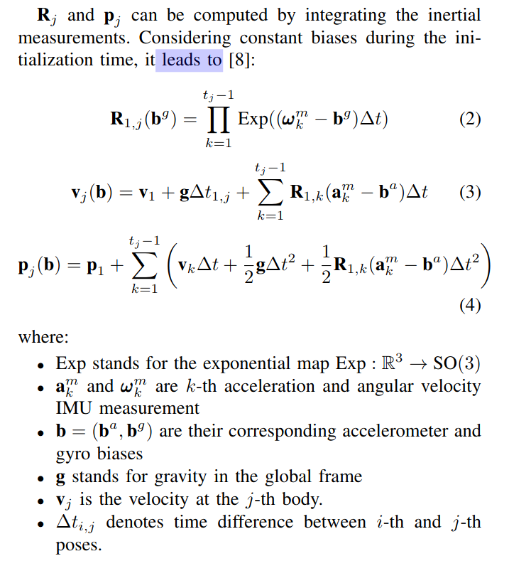

## Init Compared

### Vins mono init
#### part of V.

loosely-coupled sensor funsion method to get initial values.

include vison-only SLAM, or Structure from Motion, has a good property of initialzation.

A. Sliding window Vision-Only SFM

1. stable feature tracking(>30 tracked features)

2. sufficient parallax(more than 20 rotation-compensated pixels.) between latest frame and any other frames in the sliding windows.

$$q^{c_0}_{b_k} = q^{c_0}_{c_k}\bigotimes (q^b_c)^{-1}$$
$$s\tilde{p}^{c_0}_{b_k} = s\tilde{p}^{c_0}_{c_k}-R^{c_0}_{b_k}p^b_c$$

B. Visual-Inertial Alignment
1. GyroBias Calibration. Consider 

from SFM $q^{c_0}_{b_{k+1}}$ and $q^{c_0}_{b_k}$
from imu pre-integration $\hat{\gamma}^{b_k}_{b_{k+1}}$

so we can have：(second equation is from: linearize the IMU preintegration term with respect to gyroscope bias.)

$$\min_{\delta bw}\sum_{k\in B}||q^{c_0}_{b_{k+1}}\bigotimes q^{c_0}_{b_k}\bigotimes \gamma^{b_k}_{b_{k+1}}||^2$$

$$\gamma^{b_k}_{b_{k+1}} \approx \hat{\gamma}^{b_k}_{b_{k+1}}\bigotimes\left[\begin{matrix}
    1 \\ \frac{1}{2}J^\gamma_{b_w}\delta b_w
\end{matrix} \right] $$

2. Velocity, Gravity Vector and Metric Scale Initialization:

after gyrobias is initialized, now we has the essential state like this:

$$X_I = \left[v^{b_0}_{b_0},  v^{b_1}_{b_1}, \cdots, v^{b_n}_{b_n}, g^{c_0}, s\right]$$

we had the two equations:

$$\alpha ^{b_k}_{b_{k+1}} = R^{b_k}_{c_0}(s(\tilde{p}^{c_0}_{b_{k+1}}-\tilde{p}^{c_0}_{b_k})+\frac{1}{2}g^{c_0}\Delta t^2_k-R^{c_0}_{b_k}v^{b_k}_{b_k}\Delta t_k)$$

$$\beta^{b_k}_{b_{k+1}}=R^{b_k}_{c_0}(R^{c_0}_{b_{k+1}}v^{b_{k+1}}_{b_{k+1}}+g^{c_0}\Delta t_k-R^{c_0}_{b_k}v^{b_k}_{b_k})$$

combine here and the top-equation we can get following linear measurement model:

$$\left[\begin{matrix}
    \alpha^{b_k}_{b_{k+1}}\\\beta^{b_k}_{b_{k+1}}
\end{matrix}\right] = \left[\begin{matrix}
    -R^{b_k}_{c_0}R^{c_0}_{b_k}\Delta tv^{b_k}_{b_k}+\frac{1}{2}R^{b_k}_{c_0}\Delta t^2g^{c_0}+R^{b_k}_{c_0}(\tilde{p}^{c_0}_{b_{k+1}}-\tilde{p}^{c_0}_{b_k})s \\
    R^{b_k}_{c_0}R^{c_0}_{b_{k+1}}v^{b_{k+1}}_{b_{k+1}}+R^{b_k}_{c_0}\Delta t_k g^{c_0}-R^{b_k}_{c_0}R^{c_0}_{b_k}v^{b_k}_{b_k}
\end{matrix}\right] \\ = \left[\begin{matrix}
    -\Delta tv^{b_k}_{b_k}+\frac{1}{2}R^{b_k}_{c_0} \Delta t^2g^{c_0}+R^{b_k}_{c_0}(\tilde{p}^{c_0}_{b_{k+1}}-\tilde{p}^{c_0}_{b_k})s \\
    R^{b_k}_{b_{k+1}}v^{b_{k+1}}_{b_{k+1}}+R^{b_k}_{c_0}\Delta t_k g^{c_0}-v^{b_k}_{b_k}
\end{matrix}\right] \\ = \left[\begin{matrix}
    H^{b_k}_{b_{k+1}}X_I+n^{b_k}_{b_{k+1}}
\end{matrix} \right]$$

将$p^{c0}_{b_{k+1}}$变成$p^{c_0}_{c_{k+1}}$
$$s\tilde{p}^{c_0}_{b_k} = s\tilde{p}^{c_0}_{c_{k}}+R^{c_0}_{b_k}p^b_c$$

so the $R^{b_k}_{c_0}(\tilde{p}^{c_0}_{b_{k+1}}-\tilde{p}^{c_0}_{b_k})$ can change to: 

$$R^{b_k}_{c_0}(\tilde{p}^{c_0}_{b_{k+1}}-\tilde{p}^{c_0}_{b_k}) = R^{b_k}_{c_0}(\tilde{p}^{c_0}_{c_{k+1}}-\tilde{p}^{c_0}_{c_k}-\frac{1}{s}(R^{c_0}_{b_{k+1}}p^b_c-R^{c_0}_{b_k}p^b_c))\\
=R^{b_k}_{c_0}(\tilde{p}^{c_0}_{c_{k+1}}-\tilde{p}^{c_0}_{c_k})-\frac{1}{s}(R^{b_k}_{c_0}R^{c_0}_{b_{k+1}}p^b_c - p^b_c)$$

so the value should be delete  from the $\alpha^{b_k}_{b_{k+1}}$中的这几项，方便计算。

其中 $H^{b_k}_{b_{k+1}}$ 可以用如下公式表示：

$$H^{b_k}_{b_{k+1}} = \left[\begin{matrix}
    -I\Delta t & 0 & \frac{1}{2}R^{b_k}_{c_0}\Delta t^2_k & R^{b_k}_{c_0}(\tilde{p}^{c_0}_{c_{k+1}}-\tilde{p}^{c_0}_{c_k}) \\ -I & R^{b_k}_{c_0}R^{c_0}_{b_{k+1}} & R^{b_k}_{c_0}\Delta t_k & 0
\end{matrix}\right]$$

$$\hat{z}^{b_k}_{b_{k+1}} = \left[\begin{matrix}
    \hat{\alpha}^{b_k}_{b_{k+1}} - p^b_c+R^{b_k}_{c_0}R^{c_0}_{b_{k+1}}p^b_c\\ \hat{\beta}^{b_k}_{b_{k+1}}
\end{matrix} \right]$$

so the final optimization equation is :

$$\min_{X_I}\sum_{k \in B}||\hat{z}^{b_k}_{b_{k+1}}-H^{b_k}_{b_{k+1}}X_I||^2$$

3. Gravity Refinement
the magnitude of gravity vector is known. the result is only 2Dof remaining for gravity vector. 

reparameterize the gravity with two variables on its tangent space.

than the part is TIGHTLY-COUPLED Monocular VIO

### ORB VIO init

also use the preintegration.

IMU initialization

A. GyroBias Estimation

$$arg\min_{b_g}\sum^{N-1}_{i=1}\left|\left|\log((\Delta R_{i,i+1}Exp(J^g_{\Delta R}b_g))^TR^{i+1}_{BW}R^i_{WB} \right|\right|$$

B. Scale and Gravity Approximation
intrducing $s$ between Camera and IMU coordinate system;
$${}_wp_b = s{}_wp_c+R_{wc}{}_cp_b$$

we should neglecting the point accelerometer bias, follows like that:

$$s{}_wp_c^{i+1} = s{}_wp^i_c+{}_wv^i_b\Delta t_{i,i+1}+\frac{1}{2}g_w\Delta t^2_{i,i+1}+R^i_{wb}\Delta p_{i,i+1}+(R^i_{wc}-R^{i+1}_{wc}){}_cp_b$$

we can change the function from current equation to $\left[\begin{matrix}
    \lambda(i)& \beta(i)\end{matrix}\right]\left[\begin{matrix} s \\ g_w\end{matrix}\right] = \gamma(i)$

we can easily get these matrix.

C. Acc Bias Estimate and Scale and Gravity Direction Refinement.

estimate the $R_{wi}$

$$R_{wi} = Exp(\hat{v}\theta) \\ \hat{v} = \frac{\hat{g}_I\times\hat{g}_W}{||\hat{g}_I\times \hat{g}_W||}, \theta = atan2(||\hat{g}_I \times \hat{g}_W||, \hat{g}_I\hat{g}_W)$$

so the current Gravity vector is $g_w = R_{wi}\hat{g}_IG$

the rotation can be opti using a perturbation $\delta\theta$

$$g_w = R_{wi}Exp(\delta\theta)\hat{g}_IG$$

with a first-order approximation（一阶近似$f(x+\Delta x) = f(x)+f'(x)\Delta x$）:
$$g_w \approx R_{wi}\hat{g}_I G - R_{wi}(\hat{g}_I)^{\times}G\delta\theta$$

change status can like this:

but the ORB-SLAM3 change the init partion:

the method in ORB_SLAM-VIO(VI) is limited to pinhole monocular cameras and its initialization was too slow.

## ORB-SLAM3
1. formulation of vi initialzation as an inertial-only optimal esti problem. taking properly into account the probabilistic model of IMU noises.
2. solve for all inertial params at once. this makes all estimations jointly consistent.
3. don't make any assumptions about initial velocity or attitude, make out method suitable for any initialization case.
4. don't assume IMU bias to be zero, instead get these infos by calib or Map estimation.

Inertial-only optimization for visual-inertial Initialization

goal is going one step further and also use MAP estimation 
in the initialization, making proper use of sensor noise models.
Our novel initialization method is based on the following ideas:

1. Despite the non-linear nature of BA, Monocular SLAM is mature and robust enough to obtain very accurate initial solutions for structure and motion, with the only caveat that their estimations are up-to-scale.
2. perform inertial-only MAP estimation, taking the up-to-scale visual SLAM trajectory as constant.
3. adopt a parametrization that explicitly represents and optimizes the scale factor of the monocular SLAM solution.
4. jointly optimize all the IMU variables in one step, taking into account the cross-covariances between the preintegrated terms for position, and linear and angular velocities.

### vision-only Map Estimation
same as ORB-SLAM

### Inertial-only Map Estimation
status vector
$$X_k=\left\{ s, R_{wg}, b, \overline v_{0:k}\right\}$$

$b=\{b^a, b^g\}$ and other is defined as normal.

<!-- the up-to-scale mean change to element? -->

define $I_{i,j}$ as the preintegration of inertial measurements between i-th and j-th keyframe, and by $I_{0:k}$ the set of IMU preintegrations bwtween successive keyframes in our initialization window.

the posterior distribution is:（后验概率）
$$p(X_k|I_{0:k}) \infty p(I_{0:k}|X_k)p(X_k)$$

where $p(I_{0:k}|X_k)$ is the likelihood distribution of the IMU measurements given the IMU states, and $p(X_k)$ is the prior for the IMU states. Considering independence of measurements, the likelihood can be factorizd as:

$$p(I_{0:k}|X_k) = \prod^k_{i=1}p(I_{i-1, i}|s,g_{dir}, b, v)_{i-1}, v_i)$$

To obtain the MAP estimator
$$X^*_k = arg\max_{X_k}p(X_k|I_{0:k}) = arg\min_{X_k}\left(-log(p(X_k))-\sum^k_{i=1}log(p(I_{i-1,i}|s, g_{dir},b,v_{i-1}, v_i))\right)$$

Assuming Gaussian error for IMU preintegration and prior distribution, the MAP problem is equivalent to:
$$X^*_k = arg\min_{X_k}\left(||r_p||^2_{{\sum}_p}+\sum^k_{i=1}||r_{I_{i-1,i}}||^2_{\sum_{I_{i-1,i}}} \right)$$

where $r_p$, $r_{I_{i-1,i}}$ are the residual of the prior and IMU measurements between consecutive keyframe, while $\sum_p$ and $\sum_{I_{i-1,i}}$ are their covariances.

this function don't only inertial residuals. 

redefine the inertial residual as:

$$r_{I_{i,j}} = \left[r_{\Delta R_{ij}}, r_{\Delta v_{ij}}, r_{\Delta p_{ij}} \right]$$

$$r_{\Delta R_{ij}} = Log(\Delta R_{ij}(b^g)^TR^T_iR^T_j)$$

$$r_{\Delta v_{ij}} = R^T_i(s\overline{v}_j-s\overline{v}_i-R_{wg}g_I\Delta t_{ij})-\Delta v_{ij}(b^g, b^a)$$

$$r_{\Delta P_{ij}} = R^T_i(s\overline{p}_j-s\overline{p}_i-s\overline{v}_i\Delta t_{ij}-\frac{1}{2}R_{wg}g_I\Delta t^2_{ij})-\Delta p_{ij}(b^g, b^a)$$

the values of $\{\Delta R_{ij}(b^g), \Delta v_{ij}(b^g, b^a), \Delta p_{ij}(b^g, b^a)\}$ are preintegrated IMU measurements from i-th to j-th keyframe, which only depend on biases.

after optimizing in a manifold we need to define a retraction to update the gravity direction estimation during the optimization:

$$R^{new}_{wg}=R^{old}_{wg}Exp(\delta\alpha_g, \delta\beta_g. 0)$$

and the scale factor $s$ change equation is:
$$s^{new} = s^{old}exp(\delta s)$$

### Visual-Inertial MAP Estimation
depends on a new paper: *Fast and robust ini-tialization for visual-inertial SLAM*

solve two main drawbacks.
1. dependency on visual initialization.
2. Initialization takes too long. 

the method is from the Martinelli[1] 
but the method has same limitations:
1. assumes that all features are tracked in all frames, and that all tracks provided are correct. In case of spurious tracks, it can provide arbitrarily bad solutions.
2. initialzation accuracy is low. if increase accuracy a lot of tracks and frams are needed, increasing computational cost.
3. With noisy sensor, trajectories that are close to the unsolvable cases analyzed.

### how to solve this problem?
Generality: use partial tracks and to take into account the camera-IMU relative pose.

Efficiency:fixed number of m features and n keyframes carefully chosen, and adopting the preintegration method proposed.

## INITIAL Solution:

A. Feature extraction and tracking

.....

B. Modified Marinelli-Kaiser solution

set of the equalities:

$$p_{1_i}+R_{1_i}t_{BC}+\lambda^i_{1_i}u^i_{1_i} = p_j + R_jt_{BC}+\lambda^i_ju^i_j \\ i=1,\cdots,m, \forall j \in C^i/1_i$$

$p_j \in \R^3$ position of j-th body in the global reference frame.

$\lambda^i_j$: distance between i-th feature and j-th camera.

$u^i_j$: unitary vector from j-th camera to i-th feature in the global reference frame. can be computed as $u^i_j=R_jR_{BC}{}_{c_j}u^i_j$, being ${}_{c_j}u^i_j$ the unitary vector in the j-th camera reference frame for the i-th feature.

$[R_{BC}|t_{BC}]$: transfrom from camera to Body(IMU)

the value $R_j$ and $P_j$ can be compute by integrating the inertial measurements.

a important check:

if (during intemediate steps $b^g$ changes more than 0.2 rad/src from the value used for preintegration){

    the preintegration is recomputed with this new bias
    
} 

else{

    delta terms are directly updated using their Jacobians w.r.t biases.

}

the Jacobians is:

$$\left(\frac{\partial\Delta R_{1,j}}{\partial b^g},  \frac{\partial\Delta v_{1,j}}{\partial b^g}, \frac{\partial\Delta v_{1,j}}{\partial b^a}, \frac{\partial\Delta p_{1,j}}{\partial b^g}, \frac{\partial\Delta p_{1,j}}{\partial b^a}\right)$$

将第一个等式重写，将后面的$\Delta*$带入等式，得到如下结果：

$$\lambda^i_{1_i}u^i_{1_i}-\lambda^i_ju^i_j - v_1\Delta t_{1i,j}-g(\frac{\Delta t^2_{1,j}-\Delta t^2_{1,1_i}}{2})=\Delta p_{1,j}-\Delta p_{1,1_i}+(\Delta R_{1,j}-\Delta R_{1,1_i})t_{BC} \\ \forall i = 1,\cdots, m, \forall j \in C^i/1_i$$

add graivty magnitude infors, $g = Exp(\alpha, \beta, 0)g_I$

Equation becomes:

$$\lambda^i_{1_i}u^i_{1_i}- \lambda^i_ju^i_j - v_1\Delta t_{1_i, j} = s_{1_i, j}(b^g, b^a, \alpha, \beta)$$

where $s_{1_i, j}(b^g, b^a, \alpha, \beta) \\= Exp(\alpha, \beta, 0)g_I(\frac{\Delta t^2_{1,j}-\Delta t^2_{1,1_i}}{2})+\Delta p_{1,j}-\Delta p_{1,1_i}+(\Delta R_{1,j}-\Delta R_{1,1_i})t_{BC}$

just to update them by means of Jacobians.

ignore the $b^a$

make the equaltion simplify to $A(b^g)x = s(b^g, \alpha, \beta)$. where $x = (v_1, \{\lambda^i_j\})$. we solve the next unconstrained minimization problem.

$$(b^g, \alpha, \beta) = arg\min_{b^g, \alpha, \beta}(\min_{x}||A(b^g)x-s(b^g, \alpha, \beta)||^2_2)$$

using the following scheme:

#### the main problem is bias update, the preintegration result should update, here is cost too much.

***the change point is to update by using Jacobians.***

## imporve solution

***A.*** First BA and Observability test

solve the problem, when init at low observability the optimization can convergeto arbitrarily bad solutions.

happened when pure rotation and non-accelerated motions.

Inorder  to  detect  these  failure  cases  we  propose  anobserv-ability  test,  where  we  analyze  the  uncertainty  associated  toestimated  variables.  This  could  be  done  by  analyzing  thecovariance matrix of the estimated variables and checking ifits  singular  values  are  small  enough.  However,  this  wouldrequire  to  invert  the  information  matrix,  i.e.  the  Hessianmatrix fromfirst BA, which has high dimensions (3m+ 6 +9n−4),  being  computationally  too  expensive.  Instead,  weperform the observability test imposing a minimal thresholdto all singular values of the Hessian matrix associated to ourfirst BA. The Hessian can be built from the Jacobian matricesassociated to each edge in the graph, as explained next.

增加了一个信息矩阵，能够分辨可能存在较差初始化的情况，并且该信息矩阵规模更小，计算速度更快。

$$H_{i,j}\approx \sum_{e \in \epsilon_i and \epsilon_j}J^T_{i,e}\Omega_eJ_{j,e}$$

***B.*** Consensus test and Second BA

***C.*** Map Initialization

## reference
[1] losed-form  solution  of  visual-inertial  structure  frommotion