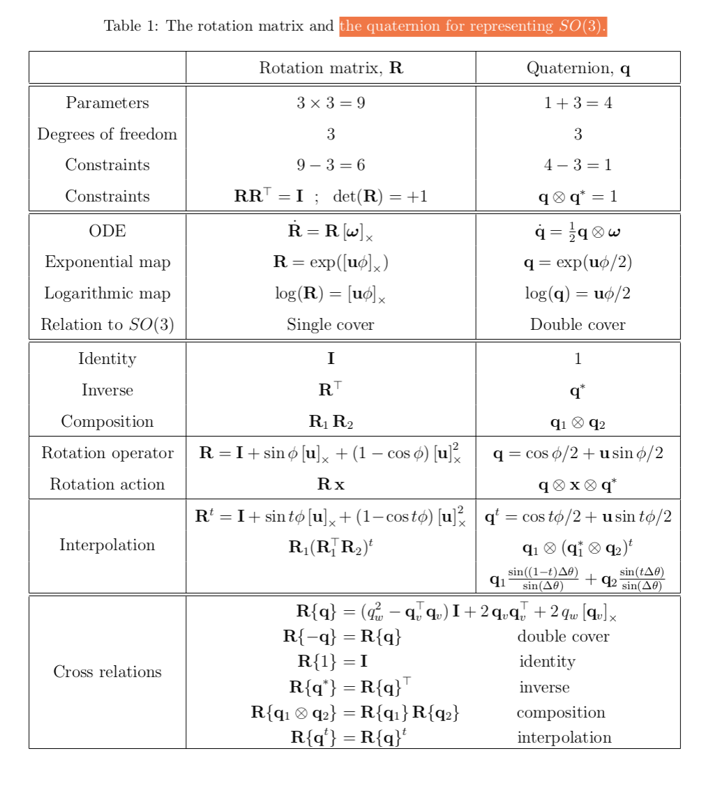

<!-- LutMath -->

### Quaternion
$$p = [p_w, p_v]^T, q = [q_w, q_v]^T$$

$$p \bigotimes q = [p_w, p_xi, p_yj, p_zk]^T\bigotimes [q_w, q_xi, q_yj, q_zk]^T\\
                 = [p_wq_w+p_wq_xi+ p_wq_yj+p_wq_zk+p_xiq_w+p \cdots]$$ 

merge the same part 
$$ = \left[ \begin{matrix}
p_wq_w-p_xq_x-p_yq_y-p_zq_z \\ 
p_wq_x+p_xq_w+p_yq_z-p_zq_y \\ 
p_wq_y-p_xq_z+p_yq_w+p_zq_x \\ 
p_wq_z+p_xq_y-p_yq_x+p_zq_w
\end{matrix}\right]$$

$$p \bigotimes q = \left[\begin{matrix}
    p_wq_w-p_v^Tq_v \\ p_wq_v+q_wp_v+p_v\times q_v
\end{matrix} \right]$$

$$p \bigotimes q \neq q\bigotimes p$$

左乘和右乘
$$q_1 \bigotimes q_2 = [q_1]_Lq_2, q_1 \bigotimes q_2 = [q_2]_Rq_1$$
$$[q]_L=q_wI+\left[\begin{matrix}
    0 & -q_v^T \\ q_v & [q_v]_\times
\end{matrix}\right], [q]_R=q_wI+\left[\begin{matrix}
    0 & -q_v^T \\ q_v & -[q_v]_\times
\end{matrix}\right]$$

### Exponential of pure quaternions

#### pure quaternions 
$$q = [0, q_x, q_y, q_z]$$
$$e^q = \sum^{\infty}_{k=0}\frac{1}{k!}q^k$$
$$v=v_xi+v_yj+v_zk, e^v=\sum^{\infty}_{k=0}v^k \\ 
let: v=u\theta, \theta=||v|| $$
$$e^{u\theta}=(1-\theta^2/2!+\theta^4/4!+\cdots)+(u\theta-u\theta^3/3!+u\theta^5/g!+\cdots)\\=cos\theta +usin(\theta)$$

### Exponential of general quaternions
做法为变成实部和虚部，这样就能利用pure quaternions的性质。

### Logarithm of unit quaternions

$$\log q = \log(cos\theta+u\sin\theta)=log(e^{u\theta})=u\theta=\left[ \begin{matrix}
    o \\ u\theta
\end{matrix}\right]$$

### quaternion and rotation Matrix

### rotation group and rotation Matrix

